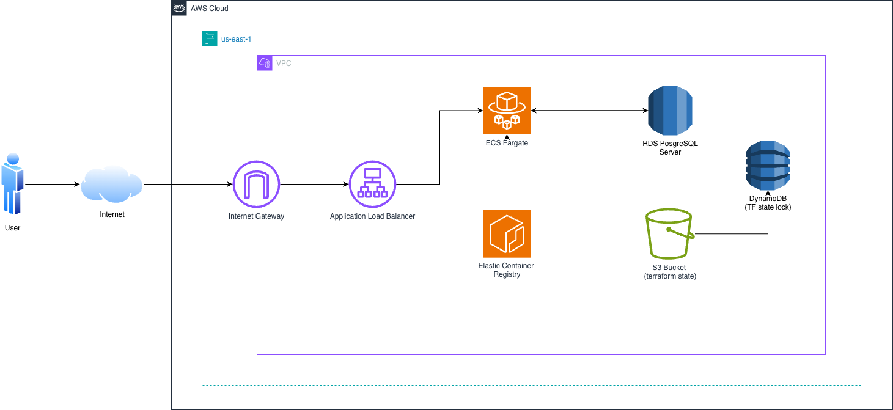

# Altair Blog

A Django blog application deployed on AWS ECS with Terraform infrastructure. Features a CI/CD pipeline using GitHub Actions, Docker containerization, and IaC security scanning with Checkov.

## Tech Stack

- **Backend:** Django 5 + Django REST Framework
- **Database:** PostgreSQL (RDS)
- **Infrastructure:** Terraform (VPC, ECS, RDS, ALB, ECR)
- **Containerization:** Docker
- **CI/CD:** GitHub Actions (Checkov, Terraform fmt/validate, Django tests)
- **Deployment:** AWS ECS Fargate

## Quick Start

```bash
# Clone and enter the project
cd altair-blog

# Set up Python environment
cd app
python -m venv .venv && source .venv/bin/activate
pip install -r requirements.txt

# Run tests
python manage.py test

# Run locally
python manage.py runserver
```

## Architecture



See `docs/DEVELOPMENT.md` for full setup instructions.
